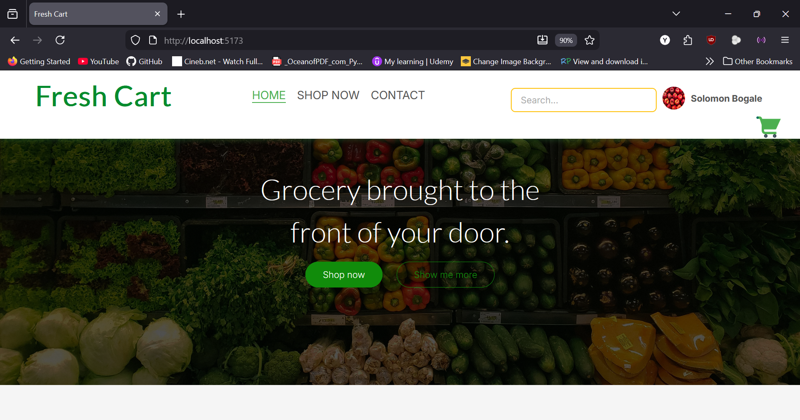
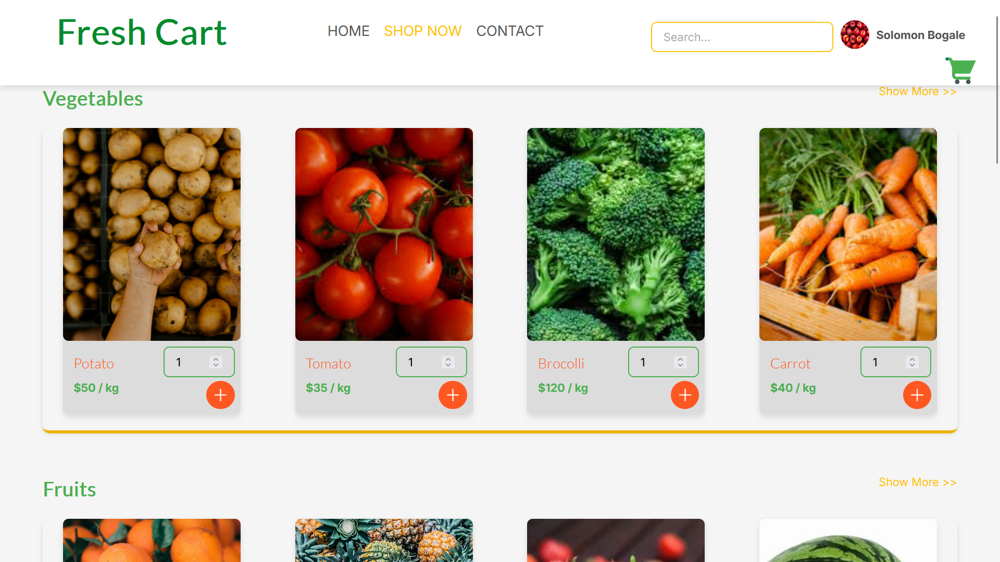
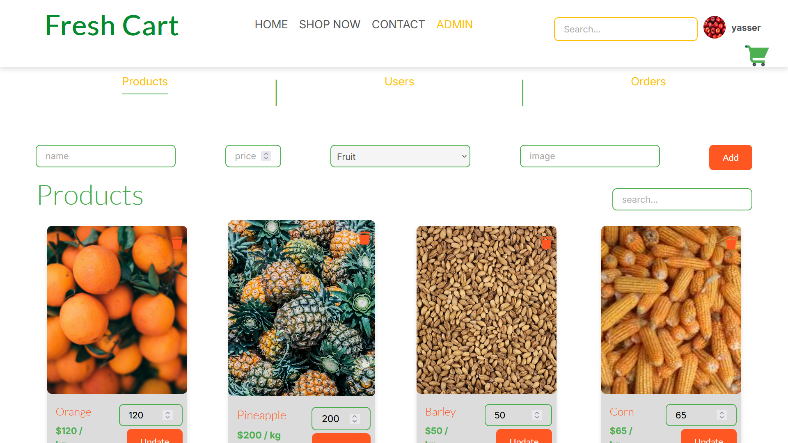

# 🛒 FreshCart Frontend For Spring

**FreshCart Frontend** is a modern React.js web application for ordering plant-based and animal products from nearby supermarkets. It integrates with a Spring Boot backend and provides a full e-commerce experience with customer and admin interfaces.

---

## 🚀 Features

### 🧑‍💻 User Features
- 🔍 **Search Products** – Search by name using real-time filtering.
- 🛒 **Add to Cart** – Browse by category and add products to your cart.
- 💸 **Checkout & Payment** – Place orders and pay via **Chapa** or **Telebirr**.
- 📦 **Order Tracking** – View your delivery info and previous orders.
- 👤 **User Profile** – Edit name, address, and other personal info.
- 🍪 **Persistent State** – Cart items and login info are stored in cookies.
- 📬 **Contact Us** – Send suggestions or inquiries using the form.

### 🛠️ Admin Features
- ➕ Add / 📝 Edit / ❌ Delete products
- 👀 View all users and update their passwords
- 📊 View all customer orders
- 💾 Manages products locally with future DB/API expansion support

---

## 🧰 Tech Stack

| Frontend       | Description                           |
|----------------|---------------------------------------|
| React.js       | UI framework                          |
| React Router   | Client-side routing                   |
| Axios          | HTTP client for API calls             |
| Context API    | Global state management               |
| Cookies        | Store cart and user info securely     |

## Screenshots

### Home page

  

### Products

  

### User Orders

  

### Admin

  

